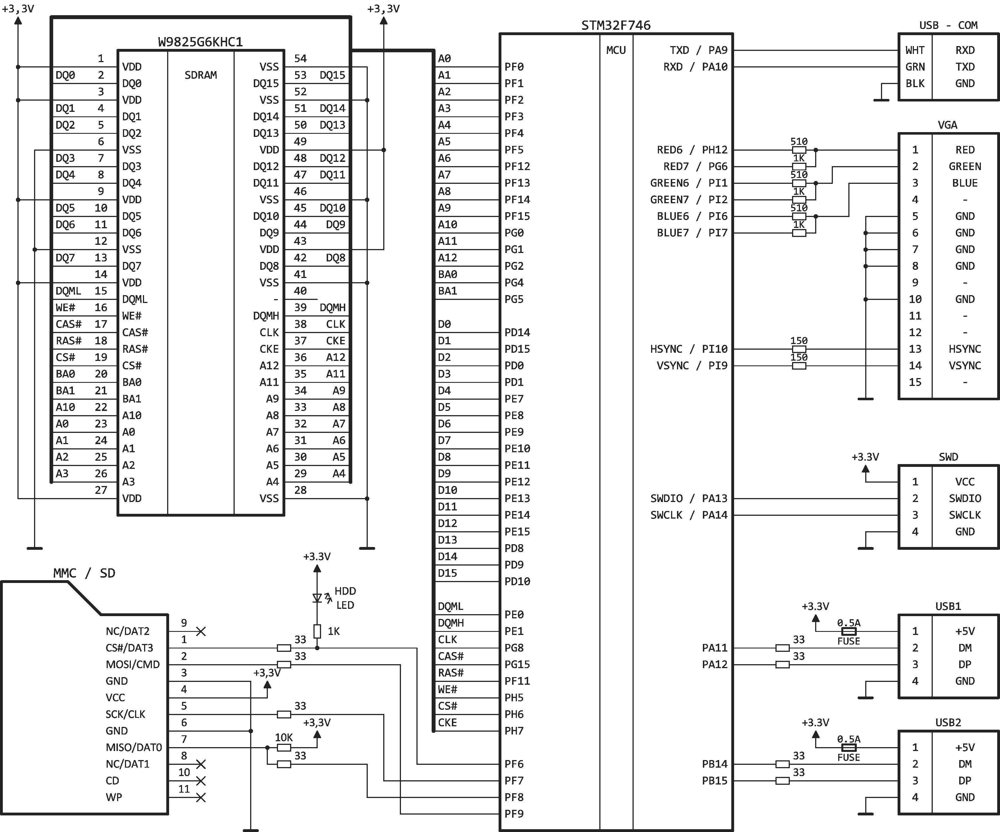

# STM32F746 port of e86r

### Compiling

Keil μVision 5 is needed to compile the project.

### Disk image

You can use Rufus tool to write an image on SD-card.

With a disk write function enabled please do not use a cheap SD-cards with a low write resource! The project has only been tested with Transcend, Samsung, and Kingston memory cards.

Maximum supported SD-card size is 32 GB.

Maximum supported HDD image size is 503 MB.
